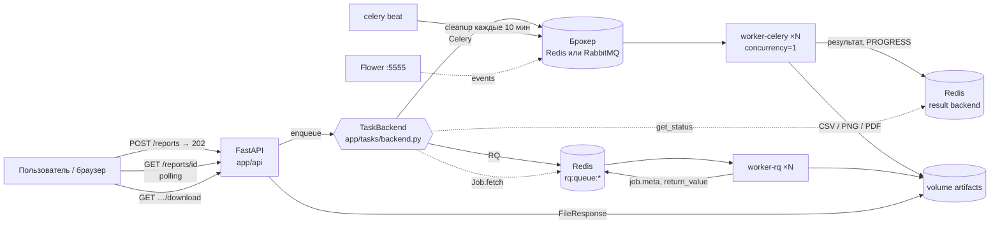
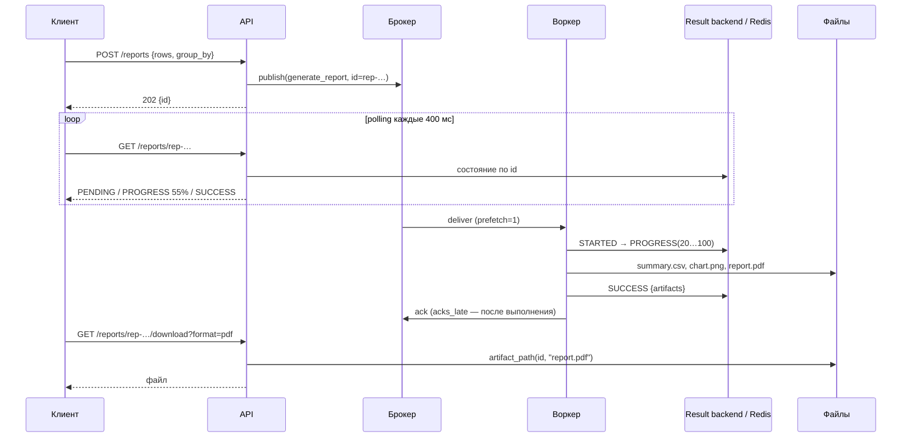
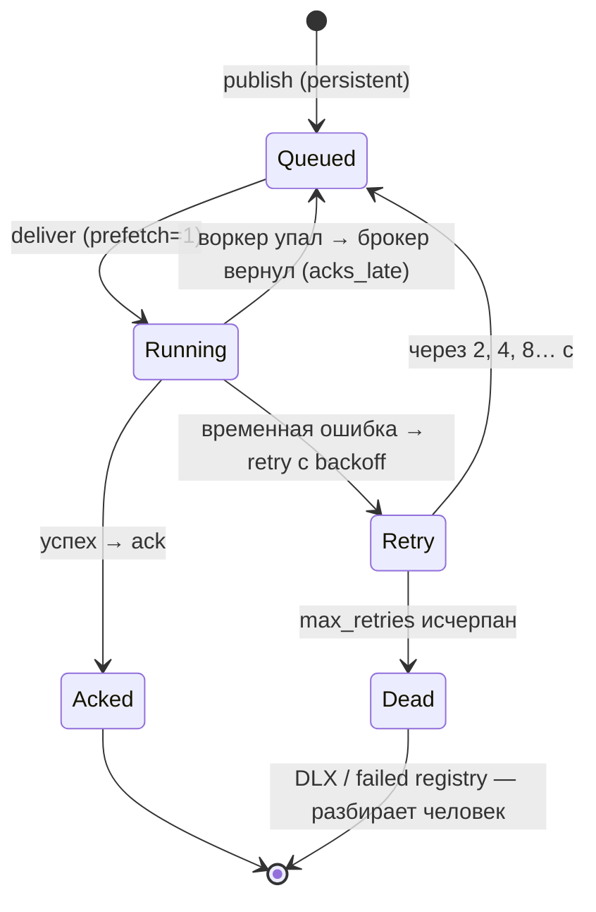

# Архитектура и обоснование решений

## 1. Компоненты

Три слоя, три причины их разделять:

| Слой | Знает о | Не знает о |
|---|---|---|
| `app/reports` (домен) | pandas, matplotlib, файлы | очередях, Celery, RQ, HTTP |
| `app/tasks` (адаптеры) | Celery / RQ / pika, брокерах | HTTP |
| `app/api` | HTTP, `TaskBackend` | том, какой фреймворк под ним |

## 2. Поток одного заказа

## 3. Надёжность: ack, retry, dead-letter

- **at-least-once** выбран сознательно: потеря заказа хуже, чем повтор. Цена — задача обязана быть идемпотентной:
  `report_id` фиксирован, данные генерируются от `seed`, файлы перезаписываются тем же содержимым.
- **Экспоненциальный backoff с jitter** (Celery `retry_backoff`, RQ `Retry(interval=[…])`): повторы не приходят «стеной»
  в тот же момент, когда внешний сервис только поднялся.
- **Poison message** (`raw_amqp.py`): счётчик попыток в заголовке, после N — `basic_nack(requeue=False)` → dead-letter exchange.
  Без этого сообщение с ошибкой крутится вечно и блокирует воркер.

## 4. Решения: почему так, альтернативы, где не работает

| Решение | Почему | Альтернативы | Где не работает / цена |
|---|---|---|---|
| **Асинхронный запрос: 202 + polling** | Генерация занимает секунды; HTTP-соединение не должно висеть; воркер можно перезапустить, не потеряв заказ | Синхронный ответ; WebSocket/SSE push; long polling | Клиент обязан уметь ждать; polling — лишние запросы (в продакшене — SSE или webhook) |
| **Абстракция `TaskBackend`** | API не зависит от Celery/RQ → честное сравнение на одном коде, замена без переписывания | Прямые вызовы `task.delay()` в API | Уникальные фичи (canvas, `depends_on`) недоступны через интерфейс — используются точечно в адаптерах |
| **`task_id = report_id`** | Статус ищется по идентификатору заказа без своей таблицы «заказ → задача»; повторная постановка с тем же id безопасна | Собственный реестр заказов в БД | Celery не отличает «неизвестный id» от «ещё в очереди» (оба PENDING). RQ отличает → 404 |
| **`acks_late=True` + `prefetch_multiplier=1`** | Падение воркера не теряет задачу; каждый воркер держит одну задачу — честное распределение при `--scale` | `acks_early` (по умолчанию) + prefetch 4 — выше throughput коротких задач | Требует идемпотентности; для тысяч микрозадач prefetch=1 медленнее |
| **Две очереди `reports` / `notifications`** | Разный профиль нагрузки: CPU-тяжёлые отчёты не задерживают быстрые уведомления; воркеры масштабируются независимо (`-Q`) | Одна очередь с приоритетами | Больше воркеров/конфигурации; приоритеты в Redis-транспорте Celery эмулируются несколькими списками |
| **Результат — файлы на volume, в result backend только имена** | Сообщение и результат в брокере должны быть маленькими; брокер — не хранилище | Результат в Redis целиком; S3/MinIO | Нужен общий volume/объектное хранилище; в кластере — обязательно S3-подобное |
| **Celery `concurrency=1` на контейнер, масштаб через `--scale`** | Один процесс = один воркер — сравнимо с RQ; показывает распределённую обработку, а не пул процессов | `--concurrency=4` в одном контейнере (prefork) | Больше контейнеров; для CPU-задач prefork в одном контейнере экономнее по памяти |
| **Redis как брокер по умолчанию** | Простота, одна зависимость (он же result backend и очередь RQ), достаточно для демо | RabbitMQ — publisher confirms, durable queues, DLX, маршрутизация | Redis может потерять сообщения при падении до fsync (AOF everysec); visibility timeout вместо настоящих ack |
| **RabbitMQ как «серьёзный» вариант** | Настоящие ack/nack, durable + persistent, DLX, prefetch, management UI | Redis Streams; Kafka (не для задач) | Ещё один сервис; Celery на RabbitMQ не даёт result backend — Redis всё равно нужен |
| **RQ `Worker` (fork на задачу) vs `SimpleWorker`** | Fork изолирует утечки памяти и падения; SimpleWorker в 10–20× быстрее на коротких задачах | Celery prefork держит пул долгоживущих процессов + `max_tasks_per_child` | Fork ≈ 85 мс/задача в Docker Desktop; для микрозадач непригоден |
| **Только JSON-сериализация** | pickle небезопасен (RCE при доступе к брокеру) и привязывает к версии кода | pickle, msgpack | Аргументы — только простые типы; pydantic-модели передаются как dict |
| **Домен не знает об очередях** | Одна функция `generate_report()` вызывается из Celery, RQ, pika и тестов; тесты домена без брокера | Логика внутри задач | Прогресс — через callback, а не напрямую `update_state` |
| **Воркеры только в Docker** | RQ использует `fork` (нет на Windows); Celery prefork на Windows нестабилен; окружение демо воспроизводимо | `--pool=solo/threads` на Windows | Локальная отладка воркера — через `docker compose exec` |

## 5. Где подход с очередями задач не работает

- **Транзакционность**: «записать в БД и поставить задачу» не атомарно — задача может уйти до commit или commit пройдёт, а publish нет.
  Решение — transactional outbox (задача пишется в ту же БД, отдельный процесс публикует).
- **Строгий порядок**: несколько воркеров = нет гарантии порядка; при retry сообщение уходит в конец. Нужен порядок — один воркер на ключ / партиции (Kafka).
- **Долгие задачи + Redis**: Celery на Redis использует `visibility_timeout` (1 ч по умолчанию): задача длиннее — будет доставлена повторно.
- **Синхронный Celery в asyncio-приложении**: `task.delay()` блокирует event loop на время publish; результат ждать `.get()` нельзя. Альтернативы — arq, Taskiq, `run_in_executor`.
- **Большие payload**: изображения, датасеты — не в сообщение, а в хранилище + ссылка.
- **Нужен запрос-ответ за миллисекунды**: очередь добавляет от единиц до сотен мс (см. эксперимент) — это не RPC.
