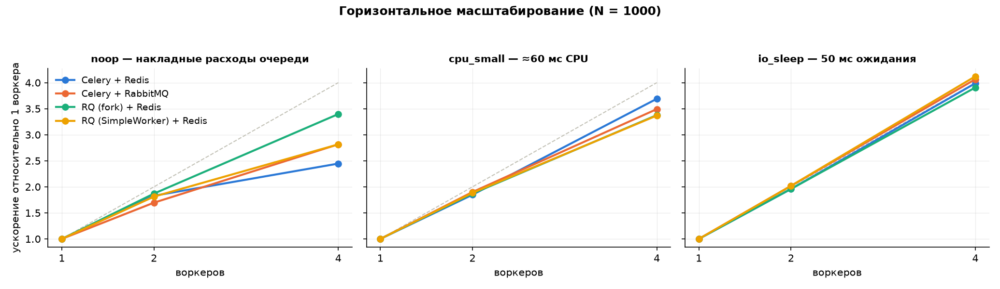
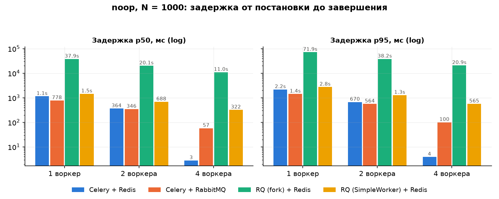
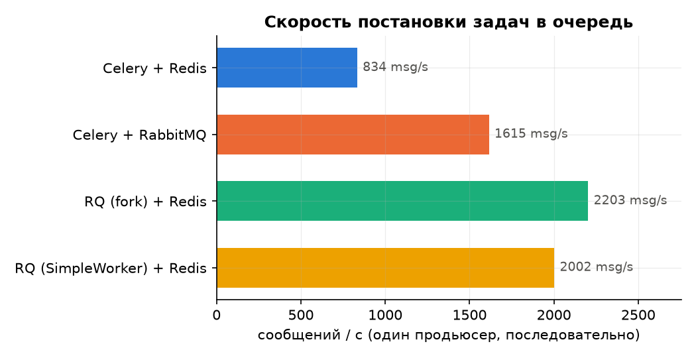

# Эксперимент: Celery vs RQ, Redis vs RabbitMQ

## Вопросы

1. Сколько «стоит» сама очередь — накладные расходы на постановку и выполнение пустой задачи?
2. Как меняется картина при CPU-задаче и при IO-ожидании?
3. Насколько линейно масштабируется пропускная способность при добавлении воркеров?
4. Отличается ли Celery на Redis от Celery на RabbitMQ при одинаковом коде задач?
5. Что даёт модель «процесс на задачу» в RQ и сколько она стоит?

## Методика

- **Одно приложение, одна полезная нагрузка** (`bench/tasks.py`), четыре конфигурации:

  | Конфигурация | Фреймворк | Брокер | Модель воркера |
  |---|---|---|---|
  | `celery-redis` | Celery 5.6.3 | Redis 7 | prefork, `--concurrency=1`, `acks_late`, `prefetch_multiplier=1` |
  | `celery-rabbitmq` | Celery 5.6.3 | RabbitMQ 3.13 | то же |
  | `rq-redis` | RQ 2.12.0 | Redis 7 | `Worker` — **fork на каждую задачу** (по умолчанию в RQ) |
  | `rq-simple-redis` | RQ 2.12.0 | Redis 7 | `SimpleWorker` — задачи в процессе воркера (аналог Celery `--pool=solo`) |

- **Виды задач**:
  - `noop` — ничего не делает: измеряет чистые накладные расходы очереди (сериализация, брокер, ack, запись результата);
  - `cpu_small` — pandas-агрегация 10 000 строк + один график matplotlib (≈60 мс CPU);
  - `io_sleep` — `time.sleep(0.05)`: имитация сетевого ожидания (HTTP, БД).
- **Нагрузка**: N = 1000 задач (для `noop` дополнительно N = 5000); воркеров 1, 2, 4 — отдельные контейнеры
  (`docker compose up --scale worker-…=N`), по одному процессу-исполнителю в каждом. Для `rq-redis` N ограничен 1000
  (fork ≈ 85 мс/задача — прогон N = 5000 на одном воркере занял бы 7+ минут).
- **Метрики** (`bench/runner.py`):
  - `enqueue_rate` — скорость постановки: один продьюсер последовательно ставит N задач;
  - `throughput` — N / (время от первой постановки до последнего завершения);
  - `latency p50/p95/p99` — от постановки до завершения задачи (включает ожидание в очереди — это то, что видит пользователь);
  - каждая задача сама пишет `enqueued_at / started_at / finished_at` в Redis-список — сборщик один для всех конфигураций
    и не зависит от result backend фреймворка.
- **Повторы**: 3 на ячейку, берётся медиана. Перед каждым прогоном очередь очищается, оркестратор ждёт нужного числа
  живых воркеров. Продьюсер запускается внутри контейнера воркера (сеть Docker, как у реального API).
- **Оркестрация**: `bench/run_matrix.py` (хост) → `docker compose … --scale` → `bench/runner.py` (контейнер) →
  `results/raw.csv` → `results/summary.csv` (медианы) → `bench/plot.py` → графики и таблицы.

## Окружение

- Хост: Intel Core i7-11700F (8 ядер / 16 потоков), 32 ГБ RAM, Windows 11, Docker Desktop 28.0.4 (WSL2, Ubuntu),
  контейнерам доступно 16 CPU и 15.6 ГиБ.
- Образы: `python:3.12-slim`, `redis:7-alpine` (`appendonly yes`), `rabbitmq:3.13-management-alpine`.
- Все контейнеры — на одном хосте; часы общие, поэтому timestamps сравнимы. Сетевые задержки между контейнерами
  минимальны (доли мс) — в продакшене с брокером на другой машине абсолютные цифры будут хуже, соотношения — похожими.

## Результаты

Полные данные: `bench/results/raw.csv` (135 прогонов), медианы: `bench/results/summary.csv`. Прогон матрицы занял 81 минуту.

### Пропускная способность

| Наблюдение | Цифры (N = 1000, 1 воркер → 4 воркера) |
|---|---|
| **Накладные расходы фреймворков одного класса одинаковы.** Celery+Redis и RQ SimpleWorker на `noop` неразличимы | 302 → 739 задач/с против 300 → 846 |
| **Fork на задачу стоит порядок величины.** RQ `Worker` (по умолчанию!) делает `fork()` на каждую задачу — ≈75 мс в Docker Desktop/WSL2 | 13 → 44 задач/с, в 23 раза медленнее SimpleWorker |
| **RabbitMQ как транспорт Celery быстрее Redis на коротких задачах** — и на постановке, и на доставке | 474 → 1336 задач/с; постановка 1600 против 900 msg/s |
| **На «настоящих» задачах брокер не важен.** При 60 мс CPU или 50 мс IO все конфигурации без fork дают одно и то же — время уходит на работу, а не на очередь | cpu_small: 17–19 → 63–67; io_sleep: 16–17 → 65–69 |
| **Даже fork-RQ на реальных задачах отстаёт «всего» в 2,5 раза, а не в 20** | cpu_small: 7 → 23 |

### Масштабирование

- `cpu_small` и `io_sleep`: ускорение ×3,4–4,1 на 4 воркерах — близко к линейному. Очередь задач — рабочий способ
  горизонтального масштабирования без координации между воркерами: брокер раздаёт задачи сам.
- `noop`, Celery+Redis: только ×2,4. Это **не** предел воркеров: при 4 воркерах p50 задержки упала до 3 мс (см. ниже),
  то есть очередь была пустой — воркеры съедали задачи быстрее, чем один продьюсер успевал их ставить (740 msg/s).
  Узкое место — продьюсер, что само по себе результат: на микрозадачах пропускная способность упирается в постановку.
- RQ fork масштабируется лучше остальных (×3,4 на noop) просто потому, что его узкое место — CPU на `fork()`, а ядер 16.

### Задержка

- Задержка здесь — от постановки до завершения, включая ожидание в очереди. При N = 1000 задач, поставленных за ~1 с,
  p50 ≈ половина времени разбора очереди: это закон Литтла, а не «медленный брокер».
- Чистые накладные расходы видны там, где очередь не накапливалась: **Celery+Redis, 4 воркера: p50 = 3 мс, p99 = 4 мс**.
  Это цена одной задачи «сериализация → Redis → воркер → результат в Redis → ack».
- p95/p99 везде ≈ 1,8–2× от p50 — хвост определяется положением в очереди, выбросов из-за фреймворков нет.

### Скорость постановки

- RQ ставит быстрее Celery (2100–2400 против 900–1650 msg/s), хотя делает больше обращений к Redis: Celery на постановке
  тратит время на протокол kombu (заголовки, сериализация сообщения AMQP-формата даже для Redis).
- Celery на RabbitMQ ставит в 1,7 раза быстрее, чем на Redis: транспорт AMQP «родной» для kombu, Redis-транспорт эмулирует его поверх списков.

### Таблицы (медианы 3 повторов)

#### noop, N = 1000

| Конфигурация | Воркеров | Постановка, msg/s | Всего, с | Пропускная, задач/с | p50, мс | p95, мс | p99, мс |
|---|---:|---:|---:|---:|---:|---:|---:|
| Celery + Redis | 1 | 989 | 3.3 | **302** | 1148 | 2186 | 2278 |
| Celery + Redis | 2 | 866 | 1.8 | **553** | 364 | 670 | 690 |
| Celery + Redis | 4 | 740 | 1.4 | **739** | 3 | 4 | 4 |
| Celery + RabbitMQ | 1 | 1645 | 2.1 | **474** | 778 | 1431 | 1488 |
| Celery + RabbitMQ | 2 | 1559 | 1.2 | **805** | 346 | 564 | 584 |
| Celery + RabbitMQ | 4 | 1552 | 0.7 | **1336** | 57 | 100 | 105 |
| RQ (fork) + Redis | 1 | 2338 | 76.3 | **13** | 37904 | 71918 | 75078 |
| RQ (fork) + Redis | 2 | 2203 | 40.7 | **24** | 20118 | 38225 | 39813 |
| RQ (fork) + Redis | 4 | 2033 | 22.5 | **44** | 10986 | 20855 | 21713 |
| RQ (SimpleWorker) + Redis | 1 | 2156 | 3.3 | **300** | 1457 | 2757 | 2875 |
| RQ (SimpleWorker) + Redis | 2 | 2014 | 1.8 | **544** | 688 | 1284 | 1338 |
| RQ (SimpleWorker) + Redis | 4 | 1669 | 1.2 | **846** | 322 | 565 | 579 |

#### noop, N = 5000

| Конфигурация | Воркеров | Постановка, msg/s | Всего, с | Пропускная, задач/с | p50, мс | p95, мс | p99, мс |
|---|---:|---:|---:|---:|---:|---:|---:|
| Celery + Redis | 1 | 932 | 17.6 | **284** | 6379 | 10974 | 11398 |
| Celery + Redis | 2 | 801 | 10.2 | **490** | 2180 | 3764 | 3898 |
| Celery + Redis | 4 | 744 | 6.7 | **752** | 3 | 4 | 4 |
| Celery + RabbitMQ | 1 | 1654 | 10.5 | **478** | 3825 | 7134 | 7429 |
| Celery + RabbitMQ | 2 | 1631 | 5.9 | **852** | 1573 | 2690 | 2777 |
| Celery + RabbitMQ | 4 | 1599 | 3.7 | **1346** | 333 | 624 | 656 |
| RQ (SimpleWorker) + Redis | 1 | 2233 | 17.1 | **293** | 7480 | 14105 | 14713 |
| RQ (SimpleWorker) + Redis | 2 | 1990 | 9.3 | **537** | 3575 | 6456 | 6718 |
| RQ (SimpleWorker) + Redis | 4 | 1789 | 5.6 | **899** | 1521 | 2580 | 2688 |

#### cpu_small, N = 1000

| Конфигурация | Воркеров | Постановка, msg/s | Всего, с | Пропускная, задач/с | p50, мс | p95, мс | p99, мс |
|---|---:|---:|---:|---:|---:|---:|---:|
| Celery + Redis | 1 | 866 | 58.3 | **17** | 29117 | 54244 | 56544 |
| Celery + Redis | 2 | 806 | 31.6 | **32** | 14944 | 28791 | 30102 |
| Celery + Redis | 4 | 803 | 15.8 | **63** | 7434 | 13928 | 14462 |
| Celery + RabbitMQ | 1 | 1596 | 52.3 | **19** | 25794 | 49154 | 51174 |
| Celery + RabbitMQ | 2 | 1514 | 27.5 | **36** | 13476 | 25451 | 26616 |
| Celery + RabbitMQ | 4 | 1346 | 15.0 | **67** | 7332 | 13636 | 14197 |
| RQ (fork) + Redis | 1 | 2126 | 145.3 | **7** | 72303 | 137595 | 143319 |
| RQ (fork) + Redis | 2 | 2376 | 77.4 | **13** | 38576 | 73097 | 76192 |
| RQ (fork) + Redis | 4 | 2153 | 42.9 | **23** | 21229 | 40146 | 41806 |
| RQ (SimpleWorker) + Redis | 1 | 2315 | 52.8 | **19** | 26216 | 49594 | 51738 |
| RQ (SimpleWorker) + Redis | 2 | 2305 | 27.9 | **36** | 13802 | 26122 | 27235 |
| RQ (SimpleWorker) + Redis | 4 | 2095 | 15.6 | **64** | 7691 | 14433 | 14986 |

#### io_sleep, N = 1000

| Конфигурация | Воркеров | Постановка, msg/s | Всего, с | Пропускная, задач/с | p50, мс | p95, мс | p99, мс |
|---|---:|---:|---:|---:|---:|---:|---:|
| Celery + Redis | 1 | 971 | 58.7 | **17** | 28771 | 54718 | 57038 |
| Celery + Redis | 2 | 976 | 30.0 | **33** | 14366 | 27483 | 28663 |
| Celery + Redis | 4 | 972 | 14.7 | **68** | 6796 | 13029 | 13586 |
| Celery + RabbitMQ | 1 | 1682 | 59.1 | **17** | 29462 | 55764 | 57906 |
| Celery + RabbitMQ | 2 | 1707 | 29.4 | **34** | 14418 | 27385 | 28484 |
| Celery + RabbitMQ | 4 | 1672 | 14.6 | **69** | 7058 | 13309 | 13856 |
| RQ (fork) + Redis | 1 | 2428 | 133.7 | **8** | 66604 | 126635 | 131965 |
| RQ (fork) + Redis | 2 | 2289 | 67.9 | **15** | 33641 | 64036 | 66773 |
| RQ (fork) + Redis | 4 | 2167 | 34.1 | **29** | 16855 | 31997 | 33333 |
| RQ (SimpleWorker) + Redis | 1 | 2407 | 63.6 | **16** | 31405 | 60136 | 62584 |
| RQ (SimpleWorker) + Redis | 2 | 2308 | 31.6 | **32** | 15447 | 29586 | 30856 |
| RQ (SimpleWorker) + Redis | 4 | 2300 | 15.5 | **65** | 7521 | 14277 | 14898 |

## Ответы на вопросы

1. **Сколько стоит очередь?** ≈ 3 мс на задачу end-to-end (Celery+Redis, пустая очередь); RQ с fork — ≈ 75 мс.
2. **CPU и IO задачи?** От 50 мс на задачу накладные расходы очереди становятся неразличимы (< 5 %) — выбирать по гарантиям и удобству, не по скорости.
3. **Масштабирование?** Близко к линейному до 4 воркеров на реальных задачах; на микрозадачах упирается в продьюсер.
4. **Redis vs RabbitMQ под Celery?** RabbitMQ быстрее в 1,5–1,8 раза на `noop` и на постановке; на реальных задачах — равны. Выбор — по гарантиям доставки.
5. **Fork в RQ?** Изоляция задач стоит порядок величины на микрозадачах и ~2,5× на 60-мс задачах. `SimpleWorker` уравнивает RQ с Celery.

## Оговорки

- Один хост: брокер, воркеры и продьюсер конкурируют за одни ядра; при 4 воркерах `cpu_small` это уже заметно.
- Docker Desktop на Windows = виртуальная машина WSL2: `fork` и файловые операции дороже, чем на «голом» Linux.
- Celery работал с включёнными событиями для Flower (`worker_send_task_events`) — это дополнительное сообщение на задачу;
  у RQ аналога нет. Реальные конфигурации Celery обычно события включают, поэтому оставлено как есть.
- RQ `enqueue` делает несколько обращений к Redis на задачу (запись job-хэша + push в очередь), Celery — одну публикацию;
  оба фреймворка умеют батчить (`enqueue_many`, повторное использование producer), здесь намеренно «наивная» постановка.
- N = 1000–5000 — микро-нагрузка: показывает порядок величин и характер масштабирования, а не пределы брокеров.
