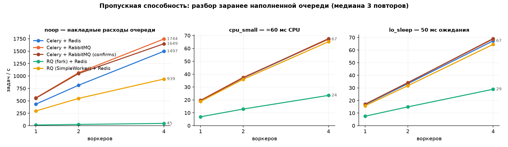

## Зачем вообще фоновые задачи
> Четыре причины вынести работу из HTTP-запроса

- **Время ответа.** Генерация отчёта, PDF, рассылка, ML-инференс — секунды и минуты. Пользователь и балансировщик столько не ждут: ответ `202 Accepted` + идентификатор вместо висящего соединения.
- **Надёжность.** Внешний сервис упал — задача **повторяется**, а не теряется вместе с запросом. Повтор с экспоненциальным backoff — встроенная функция фреймворка, а не `try/except` в контроллере.
- **Сглаживание пиков.** Очередь — буфер: приходит 1000 заказов в секунду, обрабатывается 100 — растёт очередь, а не список ошибок 500.
- **Раздельное масштабирование.** Веб-слой и воркеры масштабируются независимо: CPU-задачи не мешают отдавать страницы.
- Побочный эффект — **разделение ответственности**: домен не знает о HTTP, воркер — тонкий адаптер.

!> Очередь задач — это не «ускорение», а перенос работы во времени и обмен синхронности на надёжность.

::: notes
Начать с примера: отчёт на 10 тысяч строк генерируется 0,4–3 секунды, PDF — дольше. В синхронном API это таймаут nginx и невозможность перезапустить приложение без потери запроса.
Подчеркнуть: очередь не делает работу быстрее — общее время растёт (плюс накладные расходы), но система становится отзывчивой и устойчивой.

## Producer / consumer: базовый паттерн
> Продьюсер, брокер, консьюмер — и три разных способа их соединить

- **Producer** кладёт сообщение в брокер и сразу забывает о нём. **Consumer** забирает и выполняет. Они не знают друг о друге — связаны только форматом сообщения и именем очереди.
- **Work queue (очередь задач)**: одно сообщение — **один** обработчик. Несколько воркеров на одной очереди — это *competing consumers*, брокер сам раздаёт им работу.
- **Pub/Sub (публикация-подписка)**: одно событие — **все** подписчики, каждый со своей копией. Это уже не «задача», а уведомление о факте.
- **Разница принципиальна**: work queue балансирует нагрузку, pub/sub размножает её. Ошибка выбора — типичная причина «почему задача выполнилась четыре раза».
- В RabbitMQ обе модели — один механизм: `exchange` типа `direct` с одной очередью против `fanout` с очередью на подписчика.

::: notes
Competing consumers — ключ к горизонтальному масштабированию: чтобы добавить мощности, не нужно менять код, нужно поднять ещё один процесс-воркер. Это и покажу в эксперименте (1 → 2 → 4 воркера).

## Гарантии доставки
> «Ровно один раз» не существует — есть идемпотентность

| Гарантия | Как достигается | Риск | Когда годится |
|---|---|---|---|
| at-most-once | ack сразу при получении (`acks_early`) | задача потеряна при падении воркера | метрики, логи, некритичные уведомления |
| at-least-once | ack **после** выполнения (`acks_late`) | задача выполнится повторно | почти всё остальное |
| exactly-once | миф в распределённой системе | — | эмулируется: at-least-once + идемпотентность |

- Сбой возможен **между** выполнением и подтверждением — поэтому «ровно один раз» недостижим без общей транзакции брокера и БД.
- Практический рецепт: at-least-once + **ключ идемпотентности** (в проекте — `report_id`, результат перезаписывается тем же содержимым).
- Если воркер молчит дольше `visibility timeout` (Redis) или разорвал соединение (RabbitMQ) — сообщение вернётся в очередь другому воркеру.
- **Dead letter**: после N неудачных попыток сообщение уходит в отдельную очередь, а не крутится вечно, блокируя воркер (*poison message*).

::: notes
Главный ответ на вопрос «почему так»: выбирается не гарантия, а цена ошибки. Потерять заказ отчёта хуже, чем сгенерировать его дважды — поэтому acks_late и идемпотентность.

## Redis как брокер
> Структура данных вместо протокола

- **Как это работает**: очередь — обычный список, `LPUSH` кладёт, `BRPOP` блокирующе забирает. Никакого специального протокола очередей нет.
- **Redis Streams** (`XADD` / `XREADGROUP`) — более честная модель: consumer groups, подтверждения `XACK`, список «взятых, но не подтверждённых» (PEL) и история сообщений.
- **Персистентность**: RDB (снимки) и AOF (журнал, `appendfsync everysec`) — при падении теряется до секунды записей.
- **Чего нет**: настоящих ack для списков, exchange и маршрутизации, DLX, приоритетов (Celery эмулирует их несколькими списками), publisher confirms.
- **Ack эмулируется** `visibility_timeout` (по умолчанию 1 час у Celery): задача, выполняющаяся дольше, будет выдана повторно другому воркеру — классическая ловушка.

!> Redis — брокер «в подарок», если он уже есть в проекте. Его слабое место не скорость, а гарантии.

::: notes
Подчеркнуть: Redis-транспорт Celery надстраивает AMQP-подобную семантику поверх списков, и каждая операция ждёт ответа сервера — отсюда накладные расходы на постановку (1583 msg/s против 2333 на RabbitMQ). Но как только RabbitMQ начинает подтверждать публикацию, он проигрывает Redis в 7,5 раза.

## RabbitMQ: AMQP 0-9-1
> Брокер, спроектированный как брокер

- **Маршрутизация**: продьюсер публикует не в очередь, а в `exchange`; `binding` по ключу решает, в какие очереди попадёт копия. Типы: `direct`, `topic`, `fanout`, `headers`.
- **Подтверждения**: `basic_ack` / `basic_nack` / `basic_reject` — с `requeue=True/False`; на стороне продьюсера — *publisher confirms*.
- **`prefetch_count`** ограничивает число невыполненных сообщений на потребителя: без него быстрый воркер заберёт всю очередь, а медленный будет простаивать.
- **Durable queue + persistent message** — очередь и сообщения переживают перезапуск брокера (ценой fsync).
- **DLX** (dead-letter exchange), TTL сообщений, лимиты длины очереди, приоритеты — встроены; Management UI на `:15672` показывает очереди, скорость, потребителей.

::: notes
Показать на демо вкладку Queues в Management UI: видно reports/notifications, число потребителей, unacked. Это же — ответ на вопрос «как понять, что происходит».

## Redis vs RabbitMQ vs Kafka
> Разные инструменты, а не разные версии одного

| Критерий | Redis | RabbitMQ | Kafka |
|---|---|---|---|
| Модель | список / stream | AMQP: exchange → binding → queue | распределённый лог с партициями |
| Подтверждения | эмуляция (visibility timeout) | настоящие ack/nack, confirms | offset коммитится потребителем |
| Маршрутизация | нет | богатая (topic, fanout, headers) | по партициям/топикам |
| Сообщение после чтения | удаляется | удаляется после ack | **остаётся**, можно перечитать |
| Цена эксплуатации | минимальная | средняя | высокая (ZK/KRaft, диски) |

- **Kafka — это не очередь задач**: нет «взять одну задачу и подтвердить её», порядок держится внутри партиции, а параллелизм ограничен числом партиций. Её сила — история событий и replay.
- Практическое правило: **задача** → Redis/RabbitMQ; **событие, которое читают несколько систем и перечитывают позже** → Kafka.

::: notes
Если спросят «а почему не Kafka везде»: в Kafka нельзя подтвердить сообщение №5, не подтвердив №4, и нельзя вернуть в очередь одно упавшее сообщение — приходится строить retry-топики.

## Celery: архитектура
> Де-факто стандарт фоновых задач в Python (с 2009 года)

- Пять сущностей: **app** (реестр задач и конфиг), **broker** (транспорт), **worker** (процесс-исполнитель), **result backend** (куда кладётся результат и статус), **beat** (планировщик периодических задач).
- **kombu** — слой абстракции транспорта: один и тот же код работает на RabbitMQ, Redis, SQS. В проекте брокер меняется переменной окружения `BROKER_URL`, код задач не меняется.
- Задача — функция с декоратором; `task.delay(args)` публикует сообщение, `AsyncResult(id)` читает состояние.
- **Сериализация только JSON**: `pickle` — это исполнение произвольного кода при доступе к брокеру (RCE) и жёсткая привязка к версии классов.
- Ловушка: `PENDING` означает «я про этот id ничего не знаю» — незапущенные задачи в result backend не хранятся. Отличить «в очереди» от «такого заказа нет» нельзя.

```python
@app.task(bind=True, acks_late=True, time_limit=600)
def generate_report_task(self, report_id: str, params: dict) -> dict:
    def progress(pct, step):
        self.update_state(state="PROGRESS", meta={"progress": pct, "step": step})
    return generate_report(report_id, ReportParams(**params), progress).model_dump()
```

::: notes
Обратить внимание: задача — тонкий адаптер, вся доменная логика в generate_report. Именно поэтому одну и ту же функцию удалось прогнать через Celery, RQ и бенчмарк.

## Celery: настройки, которые меняют поведение
> Умолчания — это архитектурные решения, принятые за вас

| Настройка | Умолчание | Что делаем | Почему |
|---|---|---|---|
| `task_acks_late` | `False` | `True` | падение воркера не теряет задачу |
| `worker_prefetch_multiplier` | `4` | `1` | честное распределение между воркерами |
| `task_time_limit` / `soft` | нет | есть | зависшая задача не держит воркер вечно |
| `task_routes` | одна очередь | `reports` / `notifications` | тяжёлое не блокирует быстрое |

- **Пулы**: `prefork` (по умолчанию, процессы — для CPU), `threads`, `gevent`/`eventlet` (тысячи IO-задач на процесс), `solo` (один поток — отладка, Windows).
- **Повторы**: `autoretry_for=(ConnectionError,)`, `retry_backoff=True`, `retry_jitter` — без jitter все повторы придут одновременно и добьют внешний сервис.
- **`rate_limit`** ограничивает частоту — обязательная вещь при работе с чужим API.
- `worker_max_tasks_per_child` — перезапуск процесса каждые N задач: дёшевый способ пережить утечки памяти в чужих библиотеках.

::: notes
Тут же ответ на частый вопрос «почему у меня одна задача выполняется, а девять ждут»: prefetch_multiplier=4 при длинных задачах — воркер резервирует сообщения, которые не может выполнить.

## Celery canvas: композиция задач
> Пайплайны декларативно, без ручного связывания

- `signature` — «замороженный» вызов задачи, который можно передавать и комбинировать.
- **`chain`**: `fetch | aggregate | render` — результат предыдущей уходит аргументом в следующую (в проекте: отчёт → уведомление).
- **`group`** — параллельный запуск N задач; **`chord`** — `group` + завершающая задача, которая получает список результатов (в проекте: пакет из N отчётов → сводка).
- `map` / `starmap` / `chunks` — для массовой обработки однотипных элементов одной задачей.
- **Когда canvas — плохая идея**: длинные цепочки с ветвлением и условиями превращаются в неотлаживаемый граф; chord на Redis требует синхронизации и умеет «залипать»; состояние процесса не видно целиком. Для бизнес-процессов с компенсациями лучше workflow-движок (Temporal, Prefect).

::: notes
Показать в коде enqueue_batch — chord(group(...), summarize). И сразу оговорка: в продакшене я бы не делал цепочку длиннее 2-3 шагов.

## RQ: минимализм как принцип
> Redis Queue — весь фреймворк читается за вечер

- Три сущности: `Queue`, `Job`, `Worker`. Постановка — `queue.enqueue(func, *args)`, никаких декораторов и реестра задач.
- **Fork на каждую задачу**: воркер порождает дочерний процесс, задача выполняется там. Падение, утечка памяти, `segfault` в задаче не трогают воркер и следующие задачи.
- Честные статусы: `queued / started / deferred / scheduled / finished / failed` + `Job.fetch(id)` → можно отличить «нет такого заказа» и вернуть 404 (Celery так не умеет).
- `Retry(max=3, interval=[1, 2, 4])`, `depends_on` (задача стартует после успеха другой), `job.meta` для прогресса, failed job registry для разбора ошибок.
- **Ограничения**: только Redis; нет canvas (chord собирается вручную); не работает на Windows (нужен `fork`); отложенные повторы требуют воркера с `--with-scheduler`.

!> Цена изоляции: `fork` ≈ 72 мс на задачу в Docker Desktop — на микрозадачах это в 23 раза медленнее Celery. `SimpleWorker` убирает цену вместе с изоляцией.

::: notes
Это важный результат эксперимента и лучший пример «почему надо измерять»: по умолчанию RQ выглядит катастрофически медленным, но виновата не библиотека, а модель исполнения, которую можно переключить одной строкой.

## Современные альтернативы
> Celery и RQ — не единственный выбор

| Инструмент | Чем интересен | Когда брать |
|---|---|---|
| **Dramatiq** | простой API, надёжность «из коробки», RabbitMQ/Redis | нужен Celery без его сложности |
| **arq** | asyncio-native, один Redis, минимум кода | приложение целиком на asyncio |
| **Taskiq** | asyncio, типизация, DI в стиле FastAPI | FastAPI-проект, важны типы |
| **Huey** | очень маленький, есть SQLite-режим | небольшой сервис, не хочется брокера |
| **APScheduler** | планировщик, а не очередь | только периодические задания |
| **Temporal / Prefect** | долгие workflow, состояние, компенсации | бизнес-процессы на часы и дни |

- **FastAPI `BackgroundTasks`** — выполнение после ответа **в том же процессе**: подходит для «отправить письмо, не страшно потерять»; переживания перезапуска нет, масштабирования нет.
- Celery остаётся выбором по умолчанию из-за экосистемы (Flower, интеграции, ответы на все вопросы), а не потому, что он лучший технически.

::: notes
Если спросят про asyncio: Celery синхронный, delay() блокирует event loop на время публикации, а результат ждать через .get() внутри корутины нельзя. Выход — run_in_executor или asyncio-фреймворк.

## Распределённая обработка
> Масштабирование очередью и его отказы

- **Горизонтально**: добавить воркер = запустить ещё один процесс. Координации нет — раздаёт брокер. В эксперименте 1 → 4 воркера дали ускорение **×3,0–4,1** на всех видах задач.
- **Разделение по очередям** вместо приоритетов: `reports` (тяжёлые, CPU) и `notifications` (быстрые, IO) — разные воркеры, разное число реплик, отказ одной очереди не блокирует другую.
- **Шардирование по ключу**, когда важен порядок внутри сущности: все задачи одного клиента — в одну очередь/на один воркер.
- Отказы, к которым надо быть готовым:
  - **дубли** (at-least-once) → идемпотентность;
  - **poison message** → счётчик попыток и dead-letter;
  - **сетевой разрыв** → переподключение, повторная доставка неподтверждённых;
  - **«горячая» очередь** → автоскейл по длине очереди, а не по CPU;
  - **отравленный воркер** (утечка памяти) → `max_tasks_per_child` / fork.

::: notes
Важный практический момент: метрика для автоскейла — длина очереди и возраст самого старого сообщения, а не загрузка CPU воркера.

## Где подход не работает
> Честные границы применимости

- **Транзакционность.** «Записать в БД и поставить задачу» — не атомарно: задача может стартовать раньше commit'а или потеряться при откате. Решение — **transactional outbox**: задача пишется в ту же БД, отдельный процесс публикует.
- **Строгий порядок.** Несколько воркеров = порядка нет; повтор отправляет сообщение в конец очереди. Нужен порядок — один потребитель на ключ или Kafka с партициями.
- **Долгие задачи на Redis.** `visibility_timeout` (1 ч) меньше длительности задачи → задача выдаётся второму воркеру, и оба пишут результат.
- **Синхронный Celery в asyncio-приложении** — блокировка event loop; нужен arq/Taskiq или executor.
- **Большие payload.** Сообщение должно быть маленьким: файлы и датасеты — в S3/volume, в сообщении — ссылка. Брокер — не хранилище.
- **Запрос-ответ за миллисекунды.** Очередь добавляет от единиц до сотен мс — это не замена RPC/gRPC.

::: notes
Это слайд «почему приложение следует проектировать именно так»: у каждого решения есть область, где оно ломается, и её лучше назвать самому.

## Демо-проект: генерация отчётов
> Одна доменная функция, два фреймворка очередей, два брокера

- **Сценарий**: `POST /reports` → `202 {id}` → фоновая генерация (pandas → агрегаты → CSV + PNG + PDF) → `GET /reports/{id}` с прогрессом → скачивание артефактов.
- **Три слоя и их незнание друг о друге**:

| Слой | Знает о | Не знает о |
|---|---|---|
| `app/reports` — домен | pandas, matplotlib, файлы | очередях, Celery, RQ, HTTP |
| `app/tasks` — адаптеры | Celery, RQ, pika, брокерах | HTTP |
| `app/api` — FastAPI | HTTP, протоколе `TaskBackend` | какой фреймворк внизу |

```python
class TaskBackend(Protocol):
    def enqueue_report(self, report_id: str, params: ReportParams) -> str: ...
    def get_status(self, report_id: str) -> ReportStatus: ...
```

- Переключение `TASK_BACKEND=celery|rq` и `BROKER_URL=redis://|amqp://` — переменные окружения, код не меняется. Плюс `raw_amqp.py` — producer/consumer на голом pika, чтобы показать механику без фреймворка.

::: notes
Абстракция нужна была не ради красоты: без неё сравнение Celery и RQ было бы сравнением двух разных приложений. Цена — уникальные фичи (canvas, depends_on) используются точечно внутри адаптеров, а не из API.

## Эксперимент: методика
> 5 конфигураций × 3 типа задач × 1/2/4 воркера × 3 повтора = 135 прогонов, 89 минут

| Конфигурация | Модель исполнения |
|---|---|
| Celery + Redis | prefork, `concurrency=1`, `acks_late`, `prefetch=1` |
| Celery + RabbitMQ | то же, брокер AMQP |
| Celery + RabbitMQ + confirms | то же + подтверждение публикации — равные с Redis гарантии |
| RQ + Redis (`Worker`) | **fork на каждую задачу** — умолчание RQ |
| RQ + Redis (`SimpleWorker`) | задача в процессе воркера — аналог `--pool=solo` |

- **Задачи**: `noop` (чистые накладные расходы), `cpu_small` (агрегация 10 000 строк + график, ≈46 мс CPU), `io_sleep` (50 мс ожидания).
- **Три фазы — три разные величины**: постановка в остановленную очередь → разбор заведомо полной очереди → задержка одной задачи на пустой очереди. Иначе на микрозадачах «пропускная способность» измеряет продьюсера, а «задержка» — позицию в очереди.
- **Чистота замера**: result backend и метрики — на отдельном Redis, события Flower выключены, продьюсер в отдельном контейнере, `beat` и `flower` погашены.
- Медиана трёх повторов; 135/135 прогонов с нужным числом живых воркеров, разброс между повторами — 1 %.

::: notes
Ключевое методическое решение — общий сборщик метрик: каждая задача сама пишет timestamps в общий Redis-список, поэтому результат не зависит от особенностей result backend конкретного фреймворка.
Вторая важная вещь: очередь наполняется заранее, поэтому пропускная способность — это скорость воркеров, а не продьюсера.

## Результаты: пропускная способность


!> От ≈50 мс полезной работы на задачу фреймворк и брокер перестают влиять на пропускную способность.

::: notes
Слева направо: на noop разница в разы, на cpu_small и io_sleep все конфигурации без fork сходятся в одну точку. Это главный практический вывод: выбирать надо по гарантиям и удобству, а не по бенчмаркам на пустых задачах.

## Результаты: цифры
> Медиана трёх повторов; пропускная способность — разбор заранее наполненной очереди

| Конфигурация | noop 1w → 4w | cpu_small 1w → 4w | Постановка, msg/s | Задержка p50 |
|---|---|---|---|---|
| Celery + Redis | 434 → 1497 | 20 → 67 | 1583 | 1,8 мс |
| Celery + RabbitMQ | **560 → 1744** | 20 → 67 | 2333 | 1,8 мс |
| Celery + RabbitMQ + confirms | 554 → 1649 | 20 → 68 | **210** | 1,8 мс |
| RQ `Worker` (fork) | 13 → 45 | 7 → 24 | 2366 | **72 мс** |
| RQ `SimpleWorker` | 296 → 939 | 19 → 65 | 2567 | 3,5 мс |

- **Накладные расходы очереди — 1,8 мс** на задачу у Celery (одинаково на обоих брокерах), 3,5 мс у RQ `SimpleWorker`, 72 мс у RQ с fork.
- **От ≈50 мс полезной работы все конфигурации без fork неразличимы** — на `cpu_small` и `io_sleep` разница в пределах 2 %.
- **Масштабирование ×3,0–4,1** на четырёх воркерах: очередь — рабочий способ горизонтального масштабирования.
- **Преимущество RabbitMQ на постановке исчезает при включении publisher confirms**: 2333 → 210 msg/s, в 7,5 раза медленнее Redis. На разбор очереди confirms не влияют вовсе.

::: notes
Оговорки: один хост, Docker Desktop/WSL2 (RTT до брокера ~100 мкс, fork дороже), один однопоточный продьюсер, очередь наполнена заранее — это верхняя граница пропускной способности.

## Свой результат нужно проверять
> Первая версия эксперимента дала «RabbitMQ быстрее Redis в 1,5–1,8 раза»

| Что было не так | Как исправлено |
|---|---|
| Один Redis обслуживал брокер, события Flower и результаты — **26 команд на задачу** против 13 у конфигурации с RabbitMQ | отдельный Redis под результаты и метрики, события выключены |
| «Пропускная способность» на микрозадачах измеряла продьюсера: очередь пустовала | очередь наполняется при остановленном потреблении |
| «Задержка» была временем ожидания в очереди — закон Литтла, а не цена задачи | отдельная фаза: 30 задач по одной на пустой очереди |
| Сравнивались конфигурации с разными гарантиями публикации | добавлена конфигурация с publisher confirms |

- **Redis работал на ~10 % потолка**: 9 000 `LPUSH`/с из контейнера при нагрузке 300–1500 задач/с. Упирались в число round-trip'ов (≈110 мкс каждый), а не в сервер.
- **После перепрогона**: разрыв 1,57× → **1,29×**, масштабирование ×2,4 → **×3,45**, накладные расходы «≈3 мс» → **1,8 мс**.
- **Устояло**: цена fork в RQ, «от 50 мс брокер не важен», линейность масштабирования, идемпотентность при `acks_late`.

!> Данные первой матрицы были воспроизводимы — неверной была интерпретация. Измерять надо именно то, что собираешься сравнивать.

::: notes
Диагностика воспроизводима: bench/diagnose.py меряет потолок Redis, цену публикации в Celery и цену publisher confirms. Разбор — docs/experiment.md, раздел «Что было не так в первой версии».
Это лучший слайд для вопроса «а вы уверены в своих цифрах»: сначала проверил данные (135/135 прогонов, разброс 1 %), потом механику, потом переснял матрицу.

## Выводы: чеклист выбора
> Что брать под конкретную задачу

| Ситуация | Решение |
|---|---|
| Задача < 10 мс, потеря допустима | `BackgroundTasks` / `asyncio.create_task` — без брокера |
| Тысячи коротких задач в секунду | Celery (prefork/threads) или RQ `SimpleWorker`; **не** RQ `Worker` |
| Пайплайны, периодика, приоритеты, разные пулы | Celery |
| Уже есть Redis, задач немного, важна простота | RQ |
| Потеря задачи недопустима | RabbitMQ + `acks_late` + идемпотентность + DLX |
| Приложение на asyncio | arq / Taskiq / Dramatiq |
| Нужен порядок событий и replay | Kafka / Redis Streams — это не очередь задач |
| Долгие процессы с компенсациями | Temporal / Prefect |

- **Идемпотентность — не опция**, а условие корректности при at-least-once.
- **Умолчания фреймворков меняют гарантии и скорость в разы** — их нужно выбирать осознанно.
- **Измерять, а не верить**: разница RQ `Worker` и `SimpleWorker` — 20×, разница Redis и RabbitMQ на реальных задачах — 0 %.

::: notes
Финальная мысль: очередь задач — простая идея с дорогими деталями. Сложность не в том, чтобы поставить задачу, а в том, чтобы пережить повтор, падение и перезапуск.

## Спасибо за внимание
> Вопросы

- Репозиторий проекта: `github.com/kirillkychkin/report-queue`
- Запуск демо одной командой: `docker compose up --build` → `http://localhost:8000`
- В репозитории: `docs/architecture.md` (решения и альтернативы), `docs/experiment.md` (методика и данные), `docs/conclusions.md` (выводы), `bench/results/` (135 прогонов, графики).

::: notes
Готовые ответы: почему TaskBackend, почему acks_late, почему две очереди, почему результат в файлах, почему Redis для демо и RabbitMQ для продакшена.
